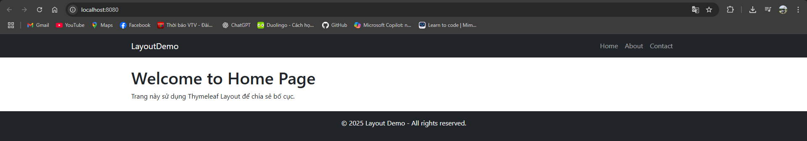

# Thymeleaf-Layout-JSP

Dự án minh họa **bố cục trang web bằng Thymeleaf Layout Dialect** trong môn học **Lập trình Java nâng cao**.

## ✨ Tính năng

- Tách layout thành **Header, Footer, Menu** tái sử dụng.
- Trang **Home, About, Contact** dùng layout chung.
- Giao diện **Bootstrap 5 + FontAwesome** hiện đại, responsive.
- Dễ mở rộng cho nhiều trang khác (Login, Register, Profile…).

## 🛠 Công nghệ

- **Java 17+**
- **Spring Boot 3 + Thymeleaf + Layout Dialect**
- **Maven**
- **Bootstrap 5**

## 📂 Cấu trúc thư mục

```css
thymeleaf-layout-demo/
│── pom.xml
│── src/main/java/com/example/layoutdemo
│ ├── LayoutDemoApplication.java
│ └── controller/PageController.java
│── src/main/resources/templates
│ ├── layouts/base.html
│ ├── layouts/header.html
│ ├── layouts/footer.html
│ ├── home.html
│ ├── about.html
│ └── contact.html
│── src/main/resources/static/css/style.css
│── screenshots/
│ └── layout-demo.png
│── README.md
│── LICENSE
│── .gitignore
```

## 🚀 Cách chạy

### 1. Build & run
```bash
mvn spring-boot:run
```

### 2. Truy cập
http://localhost:8080

## 📸 Demo giao diện


## 📜 Giấy phép
Phát hành dưới giấy phép MIT.

---
